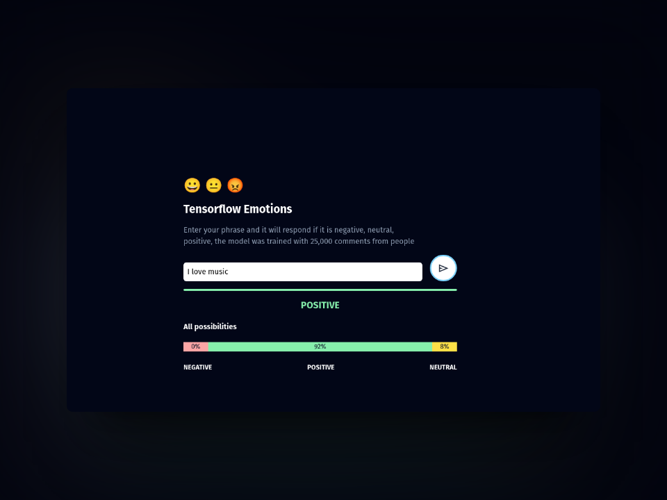
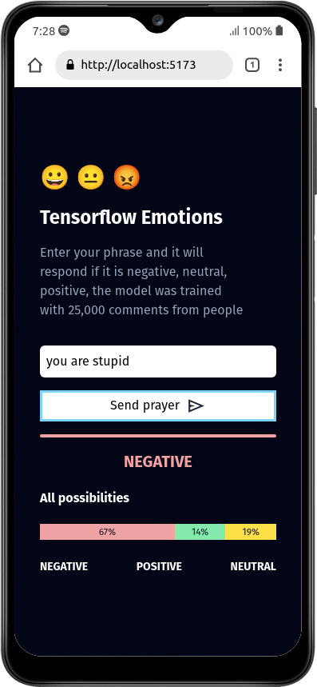

# emotions

Esta es una web que permite escribir una oración y te devuelve el sentimiento que transmite.
mediante un modelo de machine learning entrenado con 25000 oraciones.

## Instalación y configuración 🛠️

Renombrar el `.env.local.example` a `.env.local` y configurar las variables de entorno.

| Variable | Descripción |
|---|---|
| `VITE_BASE_URL` | URL de la API (Python) with model |

Para instalar las dependencias necesarias para correr el proyecto, ejecutar el siguiente comando:

```bash
npm install
```

Formato de código

```bash
npm run format
```

## Uso 🚀

Para correr el proyecto, ejecutar el siguiente comando:

```bash
npm run dev
```

## Screenshots 📷




